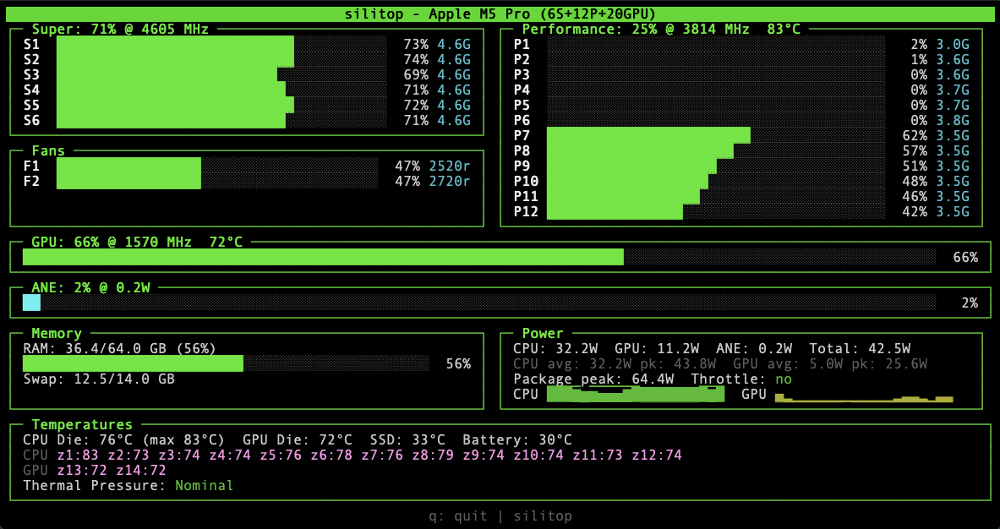

# silitop

A CLI performance monitor for Apple Silicon Macs, inspired by [asitop](https://github.com/tlkh/asitop).

Shows per-core CPU utilization, GPU usage, power consumption, memory, and die temperatures in a single dashboard.



## Features

- **Per-core CPU bars** with usage % and frequency for every core
- **Automatic core tier detection**: Super/Performance (M5), Efficiency/Performance (M1-M4)
- **GPU utilization** bar with frequency and die temperature
- **ANE** (Apple Neural Engine) usage
- **Memory** usage with swap status
- **Power** consumption: per-subsystem watts, averages, peaks, sparkline history
- **Die temperatures**: 14 thermal zones (CPU + GPU), SSD, battery
- **Thermal pressure** indicator (Nominal/Heavy/Trapping/Sleeping)
- Color-coded temperatures (cyan < 50C, yellow 50-70C, red > 70C)
- Zero Python dependencies (standard library only)
- Responsive to terminal size

## Requirements

- macOS on Apple Silicon (M1, M2, M3, M4, M5, or later)
- Python 3.8+
- Swift compiler (`xcode-select --install` if needed)
- `sudo` (required for `powermetrics`)

## Installation

```bash
git clone https://github.com/andrewleenyk/silitop.git
cd silitop
bash install.sh
```

The install script compiles the Swift temperature helper and copies both binaries to `/usr/local/bin/`.

## Usage

```bash
sudo silitop
```

### Options

| Flag | Default | Description |
|------|---------|-------------|
| `--interval N` | 1 | Sampling interval in seconds |
| `--color N` | 2 (green) | Color scheme (0=white, 1=red, 2=green, 3=yellow, 4=blue, 5=magenta, 6=cyan) |
| `--avg N` | 30 | Power averaging window in seconds |
| `--test-temps` | - | Print raw temperature sensor readings and exit |

Press `q` or `Esc` to quit.

## How it works

- **CPU/GPU/Power data**: reads Apple's `powermetrics` tool (plist output), same source as asitop
- **Temperatures**: compiled Swift helper reads IOHIDEventSystemClient thermal sensors (no SMC hacks)
- **Memory**: parses `vm_stat` and `sysctl` (no psutil dependency)

## Architecture

```
silitop (Python, curses UI)
  |
  |-- powermetrics subprocess (cpu_power, gpu_power, thermal samplers)
  |     writes plist to /tmp/silitop_pm*
  |
  |-- silitop-temps (compiled Swift binary)
        reads IOHIDEventSystemClient temperature sensors
        outputs sensor_name|temperature pairs
```

## Differences from asitop

| Feature | asitop | silitop |
|---------|--------|---------|
| Per-core CPU bars | Optional (`--show_cores`) | Always shown |
| Temperatures | No | Yes (14 die zones + SSD + battery) |
| GPU die temp | No | Yes |
| Dependencies | psutil, dashing, blessed | None (stdlib only) |
| Core tier labels | E-CPU/P-CPU only | Auto-detects (Super/Performance on M5) |
| UI framework | blessed + dashing | Pure curses |

## Contributing

Contributions welcome. Some areas that could use help:

- **Per-core temperature mapping**: the 14 die zone sensors don't map 1:1 to cores. If you can figure out the exact mapping for your chip, open an issue.
- **Fan speed**: MacBooks with fans could show RPM data.
- **M1/M2/M3/M4 testing**: built and tested on M5 Pro, needs validation on older chips.
- **Better TDP estimates**: power gauge percentages depend on max power estimates per SoC variant.
- **Bandwidth counters**: powermetrics exposes memory bandwidth data that could be displayed.

## License

MIT
